### [Nic Motta](https://nicmotta.github.io)

# Proceso / Bitácora

- [[11 de agosto - Algoritmos]](https://nicmotta.github.io/eje_espacio/#11-de-agosto)
- [[18 de agosto - OpenCV]](https://nicmotta.github.io/eje_espacio/#18-de-agosto)
- [[21 de agosto - ATMÓSFERA]](https://nicmotta.github.io/eje_espacio/#21-de-agosto)
- [[1 de septiembre] - Seminario Espacio](https://nicmotta.github.io/eje_espacio/#1-de-septiembre)
- [[4 de septiembre] - ?](https://nicmotta.github.io/eje_espacio/#4-de-septiembre)
- [[8 de septiembre] - Diferentes espacios](https://nicmotta.github.io/eje_espacio/#8-de-septiembre)
- [[9 de septiembre] - Investigación de poética](https://nicmotta.github.io/eje_espacio/#9-de-septiembre)
- [[09 de octubre] - ?](https://nicmotta.github.io/eje_espacio/#09-de-octubre)
- [[13 de octubre] - ?](https://nicmotta.github.io/eje_espacio/#13-de-octubre)
- [[26 de octubre] - Diseño + impresió de prototipo](https://nicmotta.github.io/eje_espacio/#26-de-octubre)
- [[31 de octubre] - Primer prototipo funcional portatil](https://nicmotta.github.io/eje_espacio/#31-de-octubre)
- [[1 de noviembre] - Funcionamiento + registro](https://nicmotta.github.io/eje_espacio/#1-de-noviembre)
- [[4 de noviembre] - Devolución j.crowe](https://nicmotta.github.io/eje_espacio/#4-de-noviembre)
- [[5 de noviembre] - Alejandra Ceriani - Biosensado](https://nicmotta.github.io/eje_espacio/#5-de-noviembre)
- [[10 de noviembre] - El problema de ARRAY](https://nicmotta.github.io/eje_espacio/#10-de-noviembre)
- [[16 de noviembre] - ?](https://nicmotta.github.io/eje_espacio/#16-de-noviembre)
- [[17 de noviembre] - Reflexiones acerca del proyecto](https://nicmotta.github.io/eje_espacio/#17-de-noviembre)
- [[18 de noviembre] - ](https://nicmotta.github.io/eje_espacio/#18-de-noviembre)
- [[19 de noviembre] - ](https://nicmotta.github.io/eje_espacio/#19-de-noviembre)
- [[20 de noviembre] - ](https://nicmotta.github.io/eje_espacio/#20-de-noviembre)
- [[23 de noviembre] - Idea definitiva](https://nicmotta.github.io/eje_espacio/#20-de-noviembre)

---

### [11 de agosto]

**Algoritmos de sampleo / generación de puntos**

`ArrayList <contenido> crece dinámicamente;`

Algoritmo de Poisson > generación del mejor candidato

- ¿En qué punto se encuentran el [ruido] y los datos reales?

Podemos pensar que los datos sensados de la naturaleza es una representación [y visualización] de un patrón de crecimiento, y por lo tanto, una representación de la vida.

¿Y acaso un muestreo de [ruido] que tiene como fuente sucesos / fenómenos de la naturaleza puede ser tomado como un patrón de crecimiento?

¿Por qué tomamos como válido un sensado [con defectos] de la naturaleza y no así un sensado del viento, o de la estática / campo magnético? Ambos sensados escapan de nuestra percepción natural para detectarlas y es el contexto [y la intensión] lo que lo hace verdadero o no [valido o no].

Siguiendo con la reflexión, puedo decir que no es necesario demostrar si realmente el sensado es válido como patrón de crecimiento, pero es válido como REPRESENTACIÓN de ello.

---

### [18 de agosto]

**OpenCV en openFrameworks**

_ESTRUCTURAS en el espacio_ >> ¿Público? ¿De qué tamaño? ¿Con movimiento? ¿Reacciona a algún estímulo?

---

### [21 de agosto]

**Seminario Entornos Lumínicos con Magdalena Molinari**

Campo eléctrico >> Campo magnético >> luz **>>** Todos corresponden al mismo fenómeno >> CAMPO ELECTROMAGNÉTICO [conjunción de muchas áreas que me interesan en términos medibles o numéricos]

_Schroedinger pag 66_ >> número de la luz

Colores de la **ATMÓSFERA**

---

### [1 de septiembre]

**Seminario espacio Jazmín Adler - Claudia Valente**

Pensar como conocemos el espacio >> Salir de la zona de confort

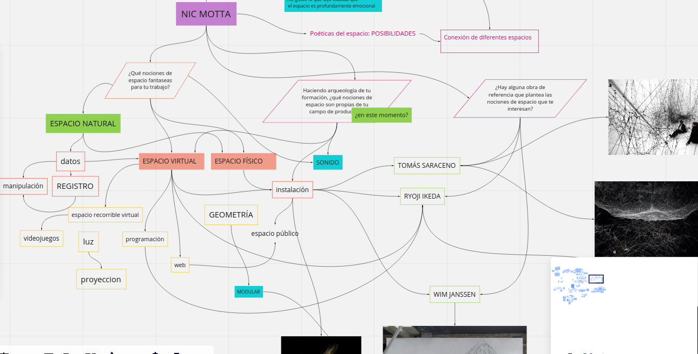

---

### [4 de septiembre]

**Boceto**

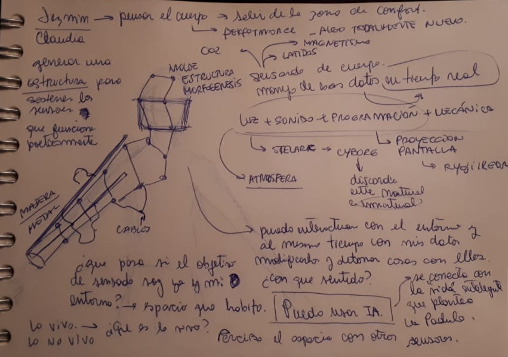

**Pasado a limpio**

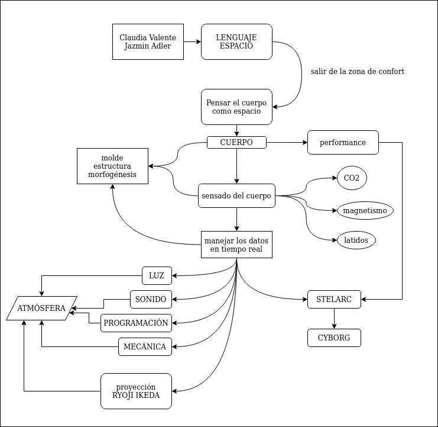

**Reflexiones:**

- Puedo interactuar con el entorno y al mismo tiempo con mis datos, modificarlos y detonar cosas con ellos. ¿Con qué sentido?

- ¿Qué pasa si el objetivo de sensado soy yo o mi entorno? >> Espacio que habito.

- Lo vivo >> ¿Qué es lo vivo? >> Lo no vivo

  - Inteligencia Artificial >> se conecta con la noción de vida inteligente que no plantea La Padula en su pregunta "¿Cómo detectar vida inteligente en Marte?".

- Percibo el espacio con otros sentidos [SENSORES]

---

### [8 de septiembre]

**Distintos espacios en el arte contemporáneo**

- Espacio físico
- Espacio conceptual
- Espacio virtual >> a partir de los '90

  - Exhibición en la web

  **Soliman López - HARDDISKMUSEUM**

_Mientras veo la presentación de Lenguaje Espacio, pienso: ¿Qué pasa con los datos? Con la veracidad de los datos, con la manipulación de ellos. ¿Hacia donde queremos [quiero] ir?_

_"(...) el viejo debate entre lo artificial y lo natural ya no es relevante (...) Estamos a la vez mediados y potenciados por la computadora. Estas nuevas formas de conceptualización y percepción de la realidad suponen algo mas que simples cambios cuantitativos de los modos de ver, pensar y actuar en el mundo. Constituyen, por el contrario, cambios cualitativos de nuestro ser, una entra nueva facultado, la post-biológica facultad de cyberception" Roy Ascott_

**TOPOLOGÍA**

_“El arte de la instalación, que en la actualidad es la forma señera en el contexto del arte contemporáneo, opera como un reverso de la reproducción. La instalación extrae una copia del presunto espacio abierto y sin marcas de la circulación anónima y lo ubica –aunque sólo sea temporalmente- en el contexto fijo, estable y cerrado de un “aquí y ahora” topológicamente bien definido. Esto quiere decir que todos los objetos dispuestos en una instalación son originales, incluso cuando –o precisamente cuando- circulen como copias fuera de la instalación” (Boris Groys, La topología del arte contemporáneo)._

---

### [9 de septiembre]

#### Investigación de poética

_¿Cómo generar una poética con el sensor [sensores] y los datos?_

**Campo ELECTROMAGNÉTICO**

El concepto campo electromagnético es un concepto formal que se utiliza en la Física para representar una perturbación en el espacio, que se propaga a través de él de manera ondulatoria y que provoca una interacción sobre las partículas con carga eléctrica.

Esa perturbación se manifiesta de dos maneras diferentes sobre las cargas, originando dos interacciones diferenciadas:

- la llamada interacción eléctrica, [modelizable] físicamente mediante el denominado campo eléctrico y

- la llamada interacción magnética, [modelizable] físicamente mediante el denominado campo magnético.

Ambos campos implican fuerzas sobre las partículas afectadas (que se manifiestan en situaciones diferentes) y por tanto son magnitudes vectoriales, con dirección, sentido e intensidad.

Los campos electromagnéticos se propagan por el espacio como ondas electromagnéticas a la velocidad de la luz (en el vacío) de acuerdo con las Ecuaciones de Maxwell, llevando asociada una energía electromagnética.

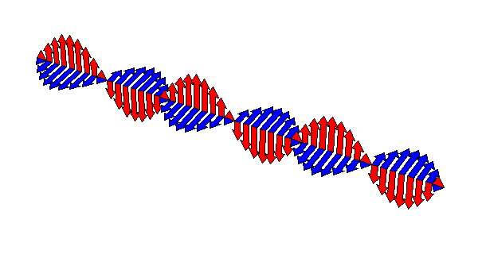

**Nomenclatura HERTZ >> frecuencias**

Un **hercio** representa un ciclo por cada segundo, entendiendo ciclo como la repetición de un suceso.

Por ejemplo, el hercio se aplica en física a la medición de la cantidad de veces por un segundo que se repite una onda (ya sea sonora o electromagnética) o puede aplicarse también, entre otros usos, a las olas de mar que llegan a la playa por segundo o a las vibraciones de un sólido. La magnitud que mide el hercio se denomina frecuencia y es, en este sentido, la inversa del período.

Un hercio es la frecuencia de una oscilación que sufre una partícula en un período de un segundo.

#### El ruido es frecuencia

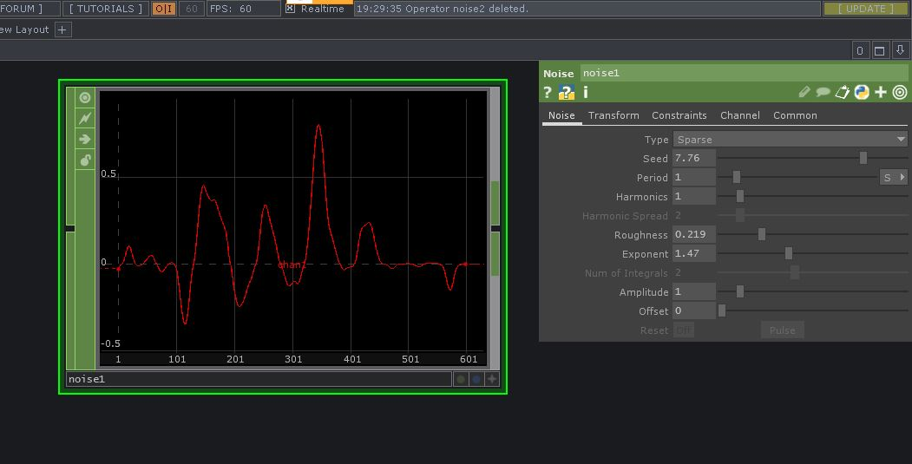

Pensar diferentes frecuencias de la atmósfera, entre ellas las que pueden ser medidas con sensores >> MPU9250, giroscópico, acelerómetro, **magnetómetro**, temperatura.

_En los 3 ejes [total 9 ejes]._

#### El humano, el entorno, la atmósfera y las frecuencias.

**¿Pensar la frecuencia como [ordenadora de comportamientos], expansión en el espacio de sistemas naturales?**

- ¿Qué relación tiene la frecuencia con **sistema_innatural_1**?
- ¿Qué relación tiene la frecuencia con la **morfogénesis**?

La programación tanto en entornos digitales como analógicos, es decir, manejo de placas controladoras y chips, dependen de la frecuencia. Del mismo modo, la frecuencia actúa tanto en el lugar donde habitamos como humanos, convive con nosotros y nos [interpela? / modifica nuestro comportamiento?].

Siguiendo este pensamiento:

- ¿Podemos pensar que la frecuencia es algo fundamental en la vida humana, terrestre, natural [e innatural]?
- **Nuevamente aparece la pregunta acerca de la vida, de lo vivo y lo no vivo**
- ¿Cómo podemos vincular todo esto en el espacio, en una poética?

### Mapa de frecuencia y pensamientos

<iframe allowfullscreen webkitallowfullscreen width="640" height="480" frameborder="0" seamless src="https://p3d.in/e/GLF0h"></iframe>

---

### [09 de octubre]

#### Soy parte del número >> soy un número, por eso me senso / registro y obtengo información

**Ejercicio de Andrés Rodríguez para Entornos Sensoriales I.**

Generar un espejo con análisis de la imagen a través de video o captura de video, utilizar OpenCV.

_Registro de mi viaje al trabajo en auto_

- Sensor MPU >> valores

  - Giroscopio XYZ

  - Acelerómetro XYZ

  - _Magnetómetro_ XYZ

  - Temperatura

- Registro en video

- Registro sonoro

_En el sketch de Processing, toda información es mostrada y afecta al video / registro._

---

### [13 de octubre]

**Diego Alberti**

**Dispositivo** >> _web / internet_ >> **Dispositivo**

---

### [17 de octubre]

#### Pensamientos acerca de mi trabajo

## 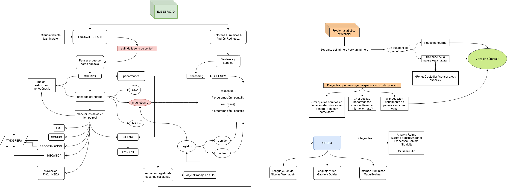

### [20 de octubre]

#### Primeras pruebas de visualidades en 3D + texturas

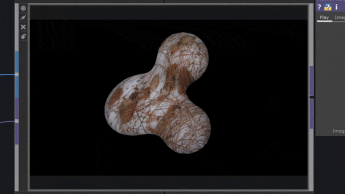

## 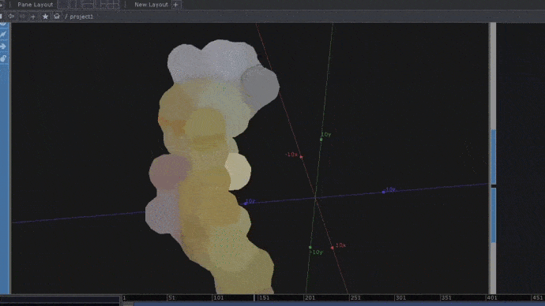

### [26 de octubre]

#### Diseño de prototipo con MPU9250

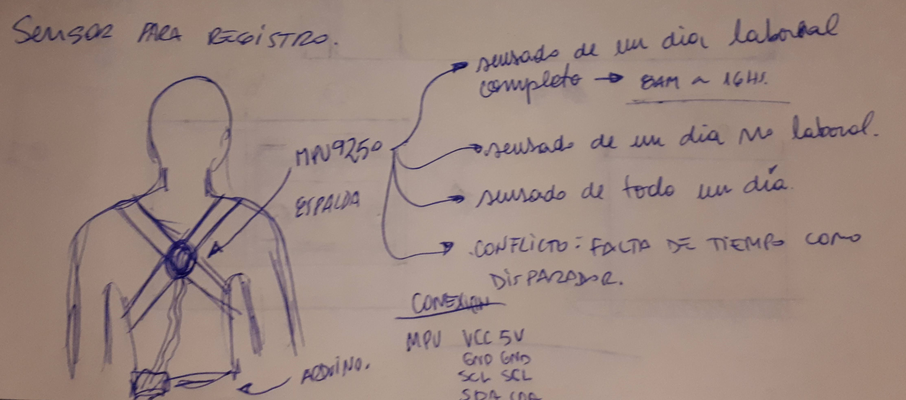

#### Diseño 3D en Rhino de carcasa para Placa + sensores

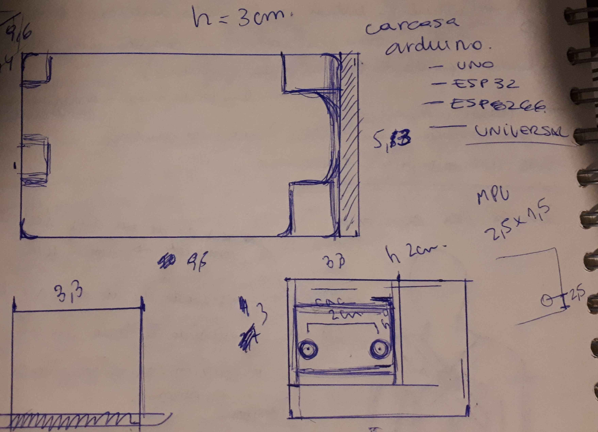

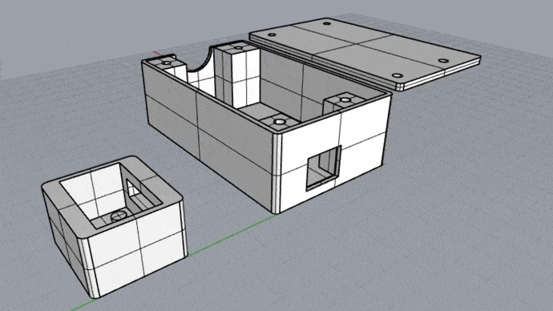

#### Impresión 3D de la carcasa

---

### [31 de octubre]

#### Primer prototipo funcional [portatil]

- ESP32 + SD y WiFi via MQTT
- MPU9250
- Caja contenedora
- PowerBank

#### Registro de datos >> ESP32 + MPU

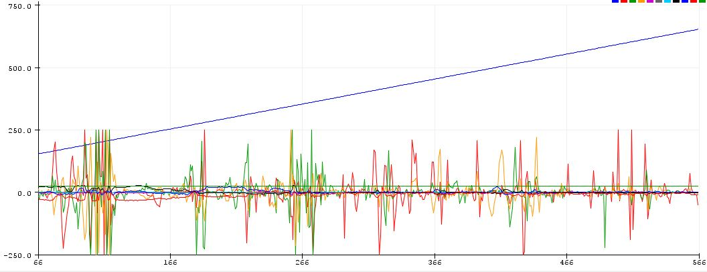

---

### [1 de noviembre]

#### Funcionamiento + registro

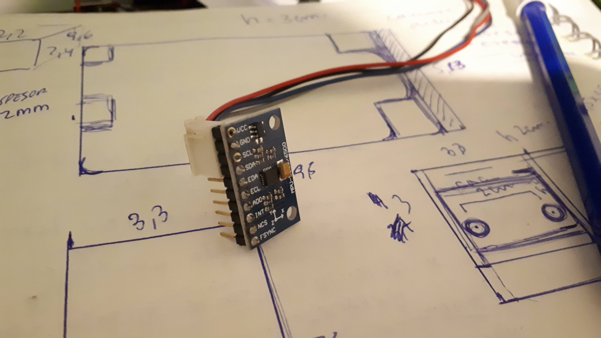
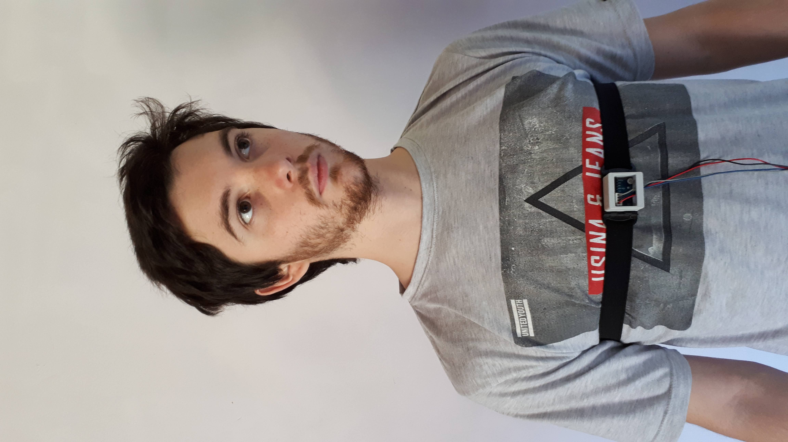
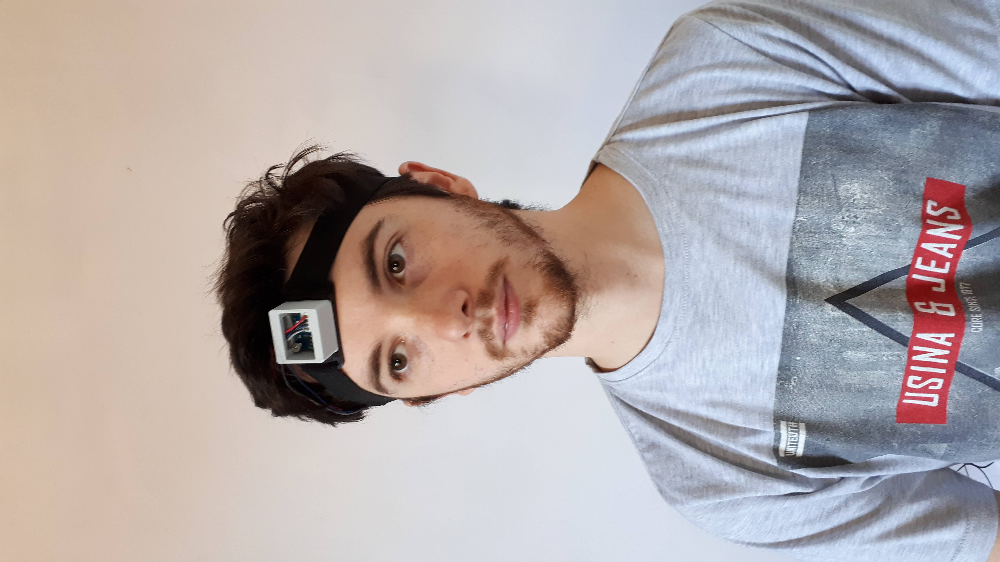

<iframe width="100%" height="400" src="https://www.youtube.com/embed/TSIidg1wooc" frameborder="0" allow="accelerometer; autoplay; clipboard-write; encrypted-media; gyroscope; picture-in-picture" allowfullscreen></iframe>

---

### [4 de noviembre]

#### Devolucion de j.crowe

- ¿Qué es lo sensible en la relación software - hardware?
    - No solo conmigo, sino con el resto.
- Poner los pies en el barro >> comportamiento celular.
  - Números cada vez más específicos.
- Curaduría de nuestros impulsos.
- Poner en tensión.

---

### [5 de noviembre]

#### Alejandra Ceriani + Federico Guerrero >> Biosensado

Iones >> potencial de acción / cadena de reacción

Cuerpo >> fuente electrónica de tensión >> electrones capacitivos *no invasivo*

Siempre se mide entre dos puntos del cuerpo, para tener referencias.
**EEC** >> muchas neuronas haciendo algo al mismo tiempo >> ejemplo de tribuna alentando
**Músculos** >> amplificador natural del cerebro.

Referencias:
  - Lisa Park - Eunoia

---

### [10 de noviembre]

#### El problema del [ARRAY]

El problema del array, pensarme como un número y la dificultad [personal] de poder ubicar esos datos en el array de un lenguaje de programación. 

- El array como capsula ordenadora
- Guardado de información 
- Backup
- El array como ordenamiento de información

*Eje Tiempo* >> Seed, Random
*Eje Espacio* >> Número, Array

- ¿Cómo conjugo todo esto que vengo pensando?

**Dificultad**

**Datos** >> formatos >> lenguajes de programación >> [array]

**El array como manipulación de información guardada**
 - Estructura de datos [todo tipo de datos]
 - Conjunto de datos >> homogeneos
    - mismo tipo
    - relacionados

Me lleva a pensar que no solo soy un número, sino que soy [o formo parte] de un array [o varios array]
  - ¿Por qué varios arrays?
  - ¿Cada array tiene un tipo de dato?

`ArrayList <contenido> crece dinámicamente;`

---

### [16 de noviembre]

**Sensados** >> banco de datos

**Sonido**

**Tipos de comportamiento** >> tipos de comportamiento que se pueden aplicar a otras cosas. No necesariamente tiene que ser una visualidad o modelos 3D. ¿Cómo serían esos tipos de comportamiento?

*¿Qué pasas con todo esto?*

---

### [17 de noviembre]

**¿Qué quiero decir con todo esto?**
- ¿Por qué el [array]?
  
  El array es la manera más utilizada para almacenar información dentro de un algoritmo o dentro de un código. 

  Si yo me senso / registro [por más que lo envie por internet o lo guarde en una memoria SD] primero estará en un array.

  Por lo tanto, si me registro [mi versión numérica] entrará en un array.

  Además el array es tan sencillo como complejo, dependiendo del lenguaje ó la manera de fraccion y guardar dentro de tal.

  En los últimos meses los estuvo utilizando constantemente con mayor o menor efectividad, es por eso que surgió **"El problema de los arrays"** como uno de los disparadores. El otro es ***"Soy parte del número, soy un número"**.

**Preguntas y posibles respuestas [ó acercamientos]**

- *¿Por qué decido sensarme?* 
  - Decido sensarme, porque me pienso como un número. Así como con [MURU 7.8](muru7-8.github.io) registramos diferentes situaciones de la naturaleza, en este caso decido porneme al mismo nivel y asumir que somos parte de la naturaleza y que como todo fenómeno puede ser medible [con mayor o menor exactitud o presición y con alta o baja tecnología]. Decido registrarme con los mismos sensores utilizados y generar un banco de datos, para luego manipularlos [o directamente manipularlos en tiempo real].

  Al mismo tiempo, incluirme en la obra, en el sensado y poner el cuerpo requiere salir de mi zona de confort tal como me lo propuso Jazmin Adler en sus clases con Claudia Valente.
  Decido asumir los riezgos y experimentar.

- *¿Qué pienso hacer con todos esos datos?*
 - En primera instancia mi idea es generar varios sensados, de diferentes situaciones y generar un banco de datos.

 - Como segunda instancia, pienso en registrar datos en tiempo real para que puedan ser procesados y generen: 
    - sonido
    - visuales
    - modelos
    - etc.

- *¿De qué manera van a relacionarse el software y hardware?*
  - Ficha técnica: utilizaré un microcontrolador ESP32 y un sensor MPU9250.
  - completar

- *Relaciones que existen en mi proyecto / idea* [desarrollar luego]
  - Relación humano - número
  - Relación humano - naturaleza
  - Relación humano - dato
  - Relación humano - máquina
    - Relación humano - software
    - Relación humano - hardware
  - Relación humano - internet
  - Relación materia - dato
  - **Relación humano - naturaleza - número**
  - continuar

- *Continuando con la relación humano - naturaleza - número*
  - Puedo pensar en la puesta en diálogo entre los distintos sensados registrados, por un lado los de la naturaleza hechos con MURU7.8, los de sistema_innatural_1 y los registros hechos sobre mi. Ponerlos al mismo nivel, compararlos. **Pensarme en número me lleva a situarme al mismo nivel que cualquier fenomeno medible.**
  - **¿Qué tal reales son sos datos?** 
    - ¿Realmente importa?

---

### [18 de noviembre]

**Pensar el sonido como dato** >> librerias Python >> Pypi.org

- Ajuste automático >> *back propagation* >> Redes neuronales

¿De qué manera puedo incorporar IA al eje_espacio para analizar los datos?
  - No sería en tiempo real
  - a partir de .txt >> Generar datos a partir de datos
  - ¿Son datos validos?
  - ¿Son datos verdaderos?

*Nos estamos moviendo a un futuro en el que entre lo sintético y lo real solamente quedará la duda en el aspecto visual.* DotCSV

### [19 de noviembre]

**Ideas hasta el momento**

**1- Etapa registro y almacenamiento de datos**
  - ESP32 conectado a internet + MPU9250 >> SHIFTR.IO
  - Algoritmo que levanta del servidor y lo hace .txt
    - Processing o p5.js >> pensado para la web (accesible para todes)

**2- Procesamiento de datos**
  - Una vez hecho varios registros >> proceso la información para generar sonido ¿utilizar IA?

**Preguntas que surgen**

Si me pienso como un número - datos
- ¿En qué se miden? ¿Qué cantidad de datos equivale a X cosa?
- ¿Un dato es lo mismo que 1000 datos? ¿Por qué?
- ¿Lo que importa es la mayor cantidad? ¿O importa más el dato procesado?
  
---

### [20 de noviembre]

#### data_nic // nic_data

- animado
- digital
- movimiento
- territorializado

**¿Cuales son los elementos que me conforman?**

Gesto >> disrrupción 

#### IDEA #3

**1- Realizar registros de muchas cosas mias y de mi entorno**
  - Esos registros 
    - sensados
    - grabaciones >> pasarlos a dato numérico - número
    - videos
    - etc           

- Con esos números >> procesarlos para generar una estructura (por ahora de manera digital) con movimiento que represente mi clon numérico de lo que soy y de lo que me rodea. Además generar sonido con esos datos.
- Pensar dicha estructura como una maqueta digita pero que puede ser trasladado a la presencialidad de un espacio.
- La realización de estos sensados fue una perfo y una manera de incluir el cuerpo (e incluirme). 

**Palabras clave**

- numero
- estructura
- datos
- movimiento
- sonido
- registro
- banco de datos
- inteligencia artifical
- cuerpo

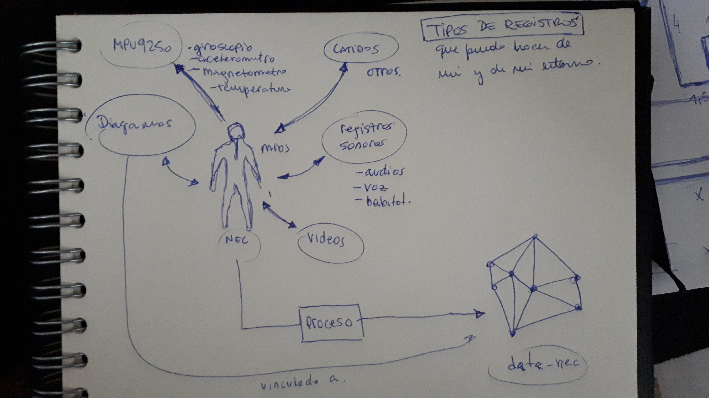

#### Principios de la narrativa transmedia (Jenkins)

- Expansión vs. profundidad
- Continuidad vs. multiplicidad
- Inmersión vs. extraibilidad
- Construcción de mundos
- Serialidad
- Subjetividad
- Realización (performance)
  
**[Scott Snibbe - Biophilia, a transmedia story of music, technology and nature](https://www.coursera.org/lecture/transmedia-storytelling/scott-snibbe-biophilia-a-transmedia-story-of-music-technology-and-nature-6A6fd?ranMID=40328&ranEAID=je6NUbpObpQ&ranSiteID=je6NUbpObpQ-B00jpcGTNLhk81HcMi4JMQ&siteID=je6NUbpObpQ-B00jpcGTNLhk81HcMi4JMQ&utm_content=10&utm_medium=partners&utm_source=linkshare&utm_campaign=je6NUbpObpQ)**

---

### [23 de noviembre]

## Idea definitiva para eje_espacio

### data_nec

**data_nec** es una inteligencia artificial alimentada con registros propios, registros de amigos / familiares y recuerdos / anecdotas relatadas por texto y audio. Como también imágenes y videos.

Se trata de un clon de mi mismo, capaz de comunicarse textualmente, sonoramente a traves de mezclas de sonidos y corporizarse en un exoesqueleto derivados de datos procesados.

El pensarme como número hizo plantearme ¿De qué manera manejo esos números? ¿Cómo los proceso? y sobre todo ¿Con qué fin?

Los recientes avances en el *machine learning >> redes neuronales* y su fácil acceso a ellas facilita la posibilidad de procesar grandes cantidades de información, sobre todo en bancos de datos, como lo es el *data mining*.

Es por esto que aprovechando las posibildades de estas inteligencias artificiales decido crear un clon basado en información mi personal, registros de mis movimientos, recuerdos y anectodas relatadas por personas de mi entorno. Una de las cosas que entendí es que es imposible situarme en el mundo pensando solamente en mi, cuando en realidad el entorno influye mucho mas de lo que pienso. 

[imagen de individuo - entorno]

El proyecto **data_nec** es el comienzo de un proceso que continuará más allá del eje_espacio. Ampliando cada vez más el banco de datos y por lo tanto mejorando el desempeño del clon. A mayor información, mejor desempeño.

[continuar]

### Funcionamiento de las partes

#### Sonoro

En el aspecto sonoro, tomaré los audios [tanto de relatos mios como de mi entorno], pasarán por un proceso a través de una IA que lo catalogará por nota musical [C, C#, D ...] 

[continuar]

#### Texto

Utilizaré una red neuronal llamada [GPT-2](https://openai.com/blog/gpt-2-1-5b-release/), la cual genera texto en base a otros textos [proporcionados por mi]. Estos textos seran relators, anecdotas y textos propios o de gente cercana a mi [mi entorno]. 
El algoritmo aprendera de todo eso y devolverá ... 

[completar]

#### Estructura / Exoesqueleto

[completar]

#### Mapa conceptual / Mapa cartográfico

[completar]

#### Cosas para pensar y reflexionar

- **El manejo de la base de datos y el orden**
- **La utilización de los registros y las acciones cotidianas**
- **Volver al array**
- **RETOMO ESTO**
  - ¿Qué pasa si el objetivo de sensado soy yo o **mi entorno**? >> **Espacio que habito**.

- **Lo vivo / Lo no vivo**
  - ¿Qué es lo vivo?

- **Inteligencia Artificial** >> se conecta con la noción de **vida inteligente** que no plantea **La Padula** en su pregunta **"¿Cómo detectar vida inteligente en Marte?"**.

- **Percibo el espacio con otros sentidos [SENSORES]**

---